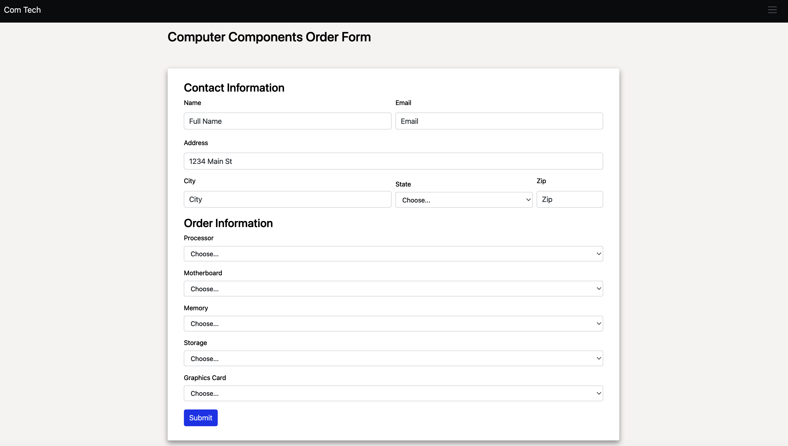
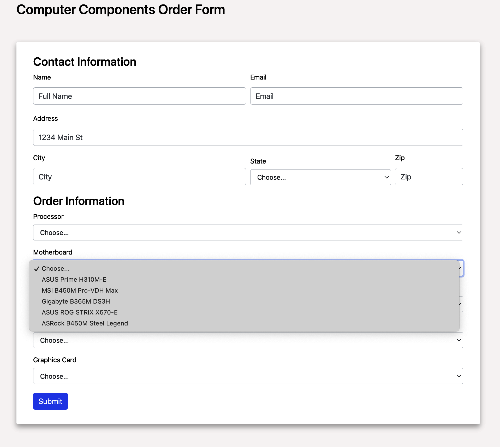
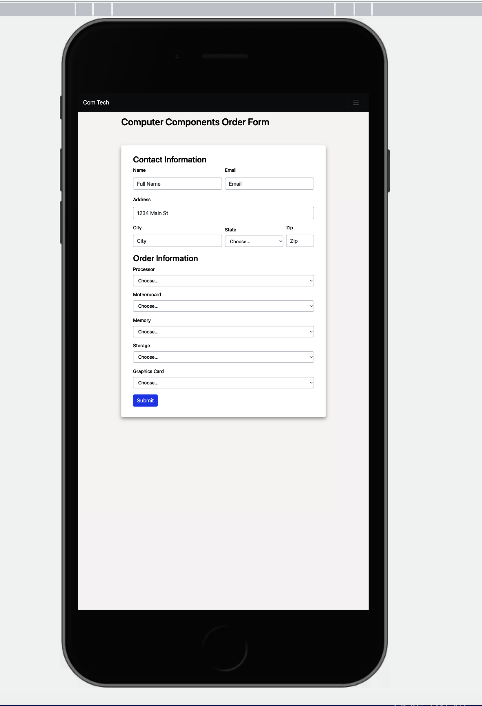
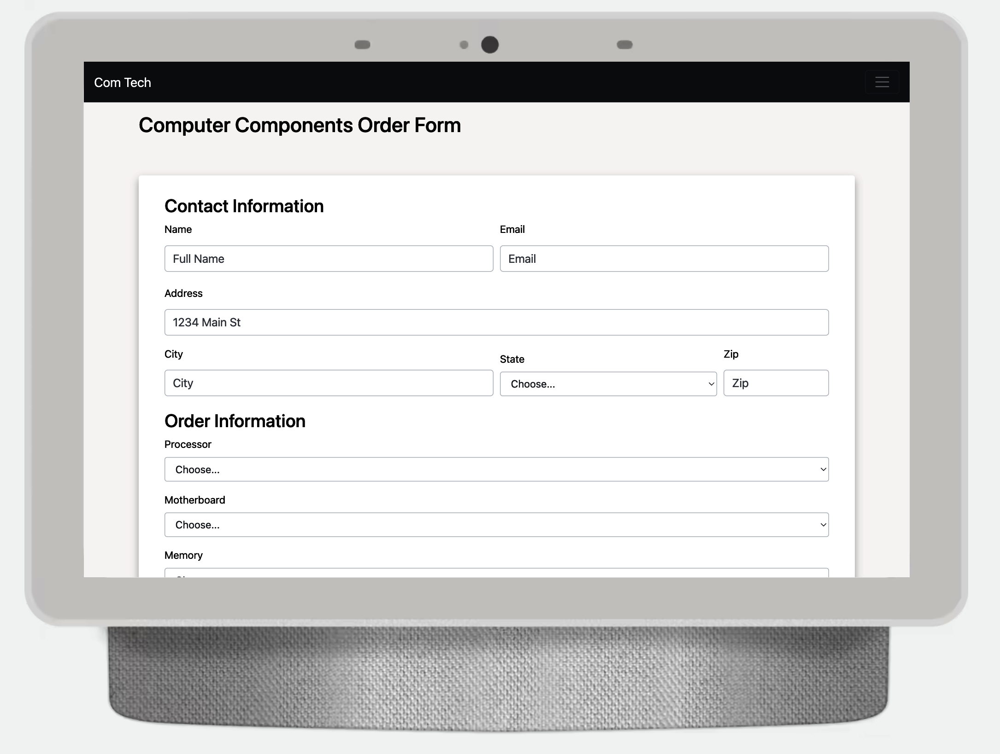
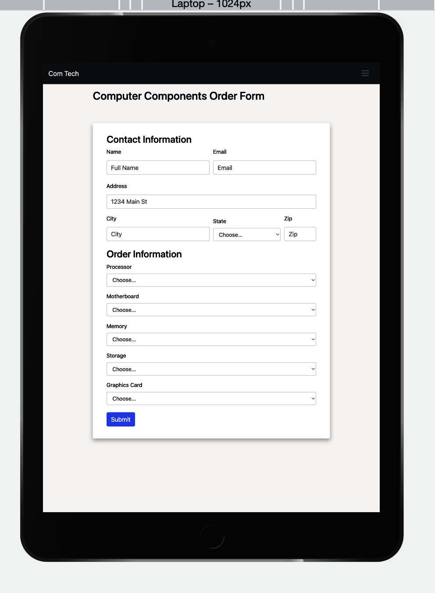

# order-form

#### This for is built by bootstrap, 
#### is responsive and validate

## To run this code

##### you shuold download or clone this repository and run localy

## this is exemples on how the form looks on the different devices

### Big screen

### Big screen

### Small screen

### Medium screen

### Medium screen

## to get responsiviness of this form i used bootstrap
[Bootstrap](https://getbootstrap.com/)
[Bootstrap navbar](https://getbootstrap.com/docs/4.0/components/navbar/)